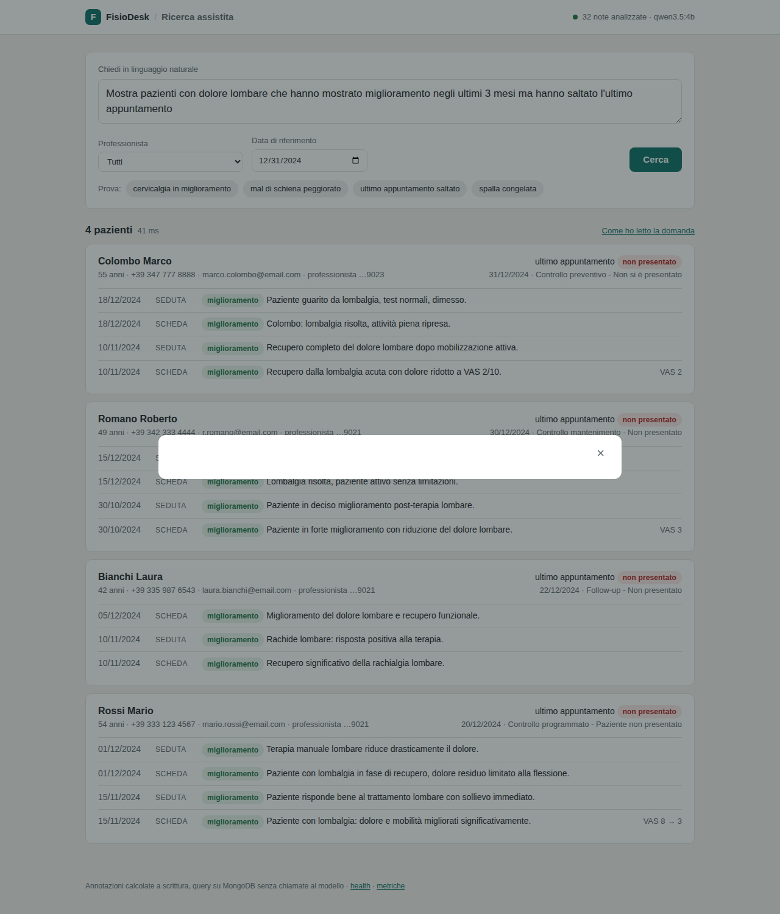
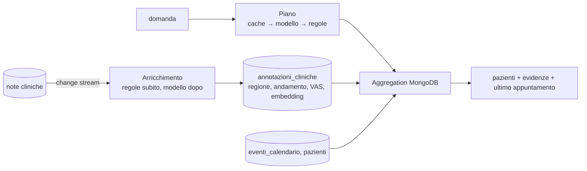

# FisioDesk · Ricerca assistita sui dati clinici

Un professionista chiede, in italiano:

> Mostra pazienti con dolore lombare che hanno mostrato miglioramento negli ultimi 3 mesi ma hanno saltato l'ultimo appuntamento

e ottiene la lista dei pazienti, con le note che giustificano la risposta e l'appuntamento saltato,
in poche decine di millisecondi. Le note cliniche in testo libero vengono lette dal modello una
volta sola, al momento della scrittura; la ricerca è un'aggregation MongoDB.

**Demo live:** http://51.178.51.24:8080 &nbsp;·&nbsp; architettura e trade-off in [docs/architettura.md](docs/architettura.md)



## Avvio

Serve solo Docker (Compose v2). Nessuna chiave API: il modello gira in locale.

```bash
git clone https://github.com/simplayy/fisiodesk-ai-healthcare.git
cd fisiodesk-ai-healthcare
docker compose up -d
```

Cosa succede:

1. `mongodb` (MongoDB Atlas Local 8.0, con Vector Search) parte e importa i dati di `data/`.
2. `app` parte in ~10 s; pochi secondi dopo le 32 note sono annotate **a regole** e la query
   target già risponde: http://localhost:8080
3. `ollama-pull` scarica i modelli (`qwen3.5:4b` + `qwen3-embedding:0.6b`, ~4 GB, solo la prima
   volta). Da quel momento l'app rielabora le note **con il modello**, una alla volta, in
   background: 20-30 s a nota su una CPU a 8 core, meno con GPU. Lo stato è in alto a destra
   nella UI e in `GET /api/annotazioni/stato`.

Da terminale, la query target con verifica del risultato atteso:

```bash
scripts/demo.sh            # oppure: scripts/demo.sh http://51.178.51.24:8080
```

```
Domanda:  Mostra pazienti con dolore lombare che hanno mostrato miglioramento negli ultimi 3 mesi ma hanno saltato l'ultimo appuntamento
Piano:    {"condizione":"dolore lombare","regione":"lombare","andamento":"miglioramento","finestra_mesi":3,"appuntamento":"ultimo_saltato","origine":"cache"}
Periodo:  2024-09-30 -> 2024-12-31   modalità: strutturata   tempi: {"piano_ms":0,"ricerca_ms":9,"totale_ms":10}

Colombo Marco, 55 anni  -  ultimo appuntamento 2024-12-31 no_show
    2024-12-18  diario  miglioramento  Paziente guarito dalla lombalgia con test funzionali normali.
    2024-12-18  schede  miglioramento  Signor Colombo: assenza di dolore lombare e recupero totale delle attività.
    ...
Romano Roberto, 49 anni  -  ultimo appuntamento 2024-12-30 no_show
Bianchi Laura, 42 anni  -  ultimo appuntamento 2024-12-22 no_show
Rossi Mario, 54 anni  -  ultimo appuntamento 2024-12-20 no_show

OK: trovati esattamente i casi attesi (Bianchi Colombo Romano Rossi)
```

Anna Ferrari (lombalgia ma peggioramento), Giuseppe Verdi (cervicalgia, appuntamento prenotato) e
Francesca Ricci (spalla, dati di giugno) restano fuori, come da `USE_CASES_AND_TESTS.md`.

### Varianti

| Cosa | Come |
|---|---|
| Usare OpenAI | `.env`: `AI_CHAT_PROVIDER=openai AI_EMBEDDING_PROVIDER=openai OPENAI_API_KEY=... OLLAMA_MODELS=""` |
| Usare Anthropic (chat) + Ollama (embedding) | `.env`: `AI_CHAT_PROVIDER=anthropic ANTHROPIC_API_KEY=...` |
| Nessun modello, solo regole | `.env`: `AI_CHAT_PROVIDER=none AI_EMBEDDING_PROVIDER=none OLLAMA_MODELS=""` |
| Cambiare "oggi" | `REFERENCE_DATE=2024-12-31` oppure `data_riferimento` nella richiesta |
| Guardare le collection | `docker compose --profile tools up -d` → http://localhost:8081 |
| Rifare le annotazioni da zero | `curl -X POST 'localhost:8080/api/annotazioni/riprocessa?daCapo=true'` |

Tutte le variabili sono in [.env.example](.env.example).

## Come funziona, in breve



**A scrittura.** Ogni nota diventa un documento in `annotazioni_cliniche`:
`problemi: [{regione: "lombare", condizione: "lombalgia", andamento: "miglioramento", vas: [8, 3]}]`,
una sintesi per il medico e l'embedding del testo. Il modello risponde in JSON vincolato allo
schema del record Java (`ClinicalFacts`), quindi "lombalgia", "mal di schiena", "low back pain" e
"colpo della strega" finiscono tutti sotto lo stesso tag. Le note già elaborate non vengono
rimandate al modello (hash del testo + versione del prompt). Prima passa un estrattore a regole,
così il sistema è usabile mentre il modello lavora o se il modello non c'è.

**A lettura.** La domanda diventa un piano di cinque campi (condizione, regione, andamento,
finestra, appuntamento) - dalla cache, dal modello entro 1,5 s, o dal parser a regole - e il piano
diventa una aggregation: filtro sulle annotazioni, gruppo per paziente, `$lookup` dell'ultimo
appuntamento e dell'anagrafica. Nessuna chiamata al modello nel percorso della richiesta. Per
condizioni fuori tassonomia ("tendinite") si passa a `$vectorSearch` sull'embedding delle note:
una lista ordinata per affinità, dichiarata come tale nella risposta, non un filtro clinico.

Dettagli, definizioni ("ultimo appuntamento", "ultimi 3 mesi") e comportamento in degrado:
[docs/architettura.md](docs/architettura.md).

## Trade-off principali

- **AI a scrittura, non a lettura.** Il costo è proporzionale alle note scritte (una chiamata per
  nota, per sempre) e non alle ricerche; la latenza della query non dipende dal modello. Il prezzo:
  una nuova nota è cercabile "bene" dopo qualche secondo (change stream) e non nell'istante stesso,
  e una nuova sfumatura da estrarre richiede una rielaborazione (versionata, progressiva).
- **Tag strutturati per la precisione, embedding solo come ripiego.** Misurato sul dataset con
  tre modelli di embedding (qwen3-embedding, embeddinggemma, bge-m3): "dolore al ginocchio" e
  "dolore al collo" risultano più vicini a "dolore lombare" che a qualsiasi altra cosa, e una nota
  di cervicalgia batte quattro note lombari sulla query "dolore lombare". Nessuna soglia separa
  regioni vicine, quindi il filtro clinico è il tag estratto dal modello; la ricerca vettoriale
  resta, dichiarata e con punteggio visibile, per ciò che la tassonomia non copre. Per rendere
  precisa una condizione nuova si aggiunge un valore alla tassonomia e si rielaborano le note.
- **Modello locale di default.** Zero costo per chiamata e dati che non escono dalla macchina,
  al prezzo di 20-30 s a nota su CPU. Il provider è una riga di configurazione: in produzione un
  modello cloud economico (o una GPU) porta l'arricchimento a meno di un secondo a nota senza
  toccare il codice.
- **Regole come rete di sicurezza e come verità dei test.** Il parser a regole non è "il mock":
  è ciò che risponde quando il modello è assente, lento o non conforme, ed è deterministico, quindi
  i test end-to-end girano senza modelli e senza chiavi.

## Vincoli

**Performance.** Piano in cache e aggregation su indici: la query target risponde in 10 ms sul
server della demo (VPS 8 vCPU, tutto lo stack sulla stessa macchina). Con k6, 50 utenti virtuali
per 30 secondi che alternano tre domande e quattro professionisti (`scripts/load-test.js`):

```
http_reqs..........: 14445   480/s
http_req_duration..: avg=104ms  med=90ms  p(90)=158ms  p(95)=193ms  max=1.75s
http_req_failed....: 0.00%
```

Il massimo di 1,75 s è la prima richiesta di una domanda non ancora in cache: il modello locale
non risponde entro 1,5 s e la richiesta prosegue con il parser a regole.

**Costi.** Una chiamata al modello per nota scritta, una per domanda distinta (poi cache), zero
per ricerca. Per 1.300 professionisti che scrivono 20 note al giorno sono 26.000 chiamate/giorno
da ~450 token in ingresso e ~100 in uscita: con `gpt-5-mini` (0,25 $/M in ingresso, 2 $/M in
uscita a listino) circa 8 $ al giorno, con `gpt-5-nano` meno di 2 $; gli embedding
(`text-embedding-3-small`, 0,02 $/M) sono trascurabili. Con i modelli locali, zero.

**Accuratezza.** Il modello è vincolato a una tassonomia chiusa e a un JSON schema; i VAS che
non compaiono nel testo vengono scartati; ogni risultato mostra le note che lo giustificano, con
la loro data, e la fonte dell'annotazione (modello o regole). Nessun risultato è "opaco".

**Se il modello non funziona.** Il sistema resta interrogabile con le annotazioni a regole e lo
dice nella risposta (`avvisi`); la riconciliazione riprova ogni minuto.

## API

| Metodo | Percorso | Cosa fa |
|---|---|---|
| `POST` | `/api/ricerca` | `{domanda, professionista_id?, data_riferimento?}` → pazienti, evidenze, piano, tempi, avvisi |
| `GET` | `/api/ricerca/piano?domanda=` | Solo l'interpretazione della domanda |
| `GET` | `/api/pazienti/{id}/storia` | Note originali con annotazione affiancata, calendario |
| `GET` | `/api/professionisti` | Professionisti presenti nei dati |
| `GET` | `/api/annotazioni/stato` | Avanzamento dell'arricchimento, modelli, stato dell'indice vettoriale |
| `POST` | `/api/annotazioni/riprocessa?daCapo=` | Riconciliazione immediata |
| `GET` | `/actuator/health`, `/actuator/prometheus` | Salute e metriche |

```bash
curl -s localhost:8080/api/ricerca -H 'Content-Type: application/json' \
  -d '{"domanda": "pazienti con cervicalgia migliorati negli ultimi 3 mesi", "professionista_id": "507f1f77bcf86cd799439021"}' | jq
```

## Repository

```
src/main/java/it/fisiodesk/assistant/
  clinical/     tassonomia (Regione, Andamento), ClinicalFacts, dizionario
  enrichment/   annotazioni: estrattori (regole, LLM), servizio, change stream, indice vettoriale
  query/        QueryPlan, planner (regole, LLM), cache, aggregation, DTO
  api/          controller REST
  config/       proprietà, modelli AI configurati, indici
src/main/resources/static/   UI (HTML, CSS, JS senza dipendenze)
src/test/                    gold set delle 32 note, parser, end-to-end su Atlas Local (Testcontainers)
scripts/                     seed Mongo, demo.sh, load-test.js (k6)
docs/                        architettura, screenshot
data/                        dataset fornito
```

Stack: Java 25, Spring Boot 4.1, Spring AI 2.0 (Ollama / OpenAI / Anthropic), Spring Data MongoDB,
MongoDB Atlas Local 8.0, Ollama, Gradle. Java e Spring perché è lo stack di FisioDesk: il servizio
può essere incorporato nel monolite esistente così com'è. Spring AI evita di scrivere a mano i
client dei provider, gli structured output e lo switch fra modelli.

## Test

```bash
./gradlew test        # JDK 25 e Docker (Testcontainers avvia mongodb-atlas-local)
```

- `RuleExtractorTest`: gold set costruito a mano per tutte le 32 note (regione e andamento attesi).
- `RulePlannerTest`: la domanda target e le sue varianti.
- `AssistantApplicationTest`: end-to-end sul dataset, senza modelli: la query target restituisce
  esattamente i quattro positivi; scoping per professionista; effetto della data di riferimento;
  altre domande della stessa famiglia; change stream su una nota nuova; validazione input.

## Limiti e prossimi passi

- Copre la famiglia di domande "condizione + andamento + finestra + appuntamento". Domande diverse
  ("chi non ha fatture pagate") richiedono altri piani, non un altro sistema.
- L'andamento è giudicato nota per nota. Il passo successivo naturale è la serie temporale dei VAS
  per paziente (da 8 a 3 in 30 giorni) come segnale indipendente dal testo.
- Il parser a regole assegna un andamento all'intera nota; una nota che parla di due regioni con
  andamenti diversi è gestita bene solo dal modello.
- La modalità semantica dipende dalla qualità degli embedding sull'italiano clinico, che con i
  modelli locali provati è modesta (numeri in `docs/architettura.md`); nel suo pre-filtro
  l'andamento è a livello di nota, non di problema.
- Nessuna autenticazione: in produzione il servizio sta dietro il gateway del gestionale e
  `professionista_id` viene dal token.
