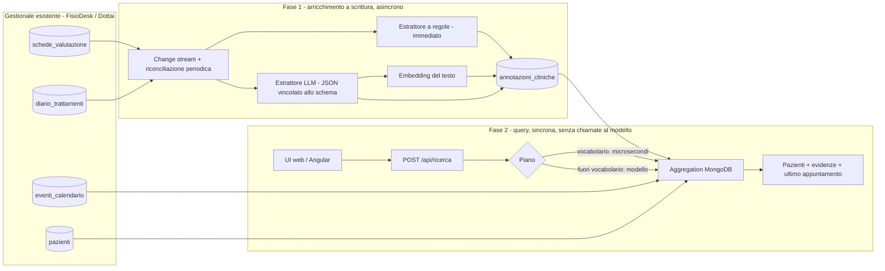

# Architettura

Il problema da risolvere è una domanda del tipo *"pazienti con dolore lombare, migliorati negli
ultimi 3 mesi, che hanno saltato l'ultimo appuntamento"* su note cliniche scritte a mano libera,
con risposta sotto i 2 secondi per decine di professionisti contemporanei e un budget AI limitato.

L'idea centrale: **il modello lavora quando si scrive, non quando si cerca.** Ogni nota viene letta
dal modello una volta sola e trasformata in pochi campi strutturati; la domanda del professionista
viene tradotta in un piano di cinque campi; la ricerca vera è un'aggregation MongoDB su indici.



## Fase 1 - arricchimento a scrittura

Per ogni documento di `schede_valutazione` e `diario_trattamenti` viene scritto un documento in
una collection nuova, `annotazioni_cliniche`. Le collection del gestionale non vengono toccate.

```js
{
  _id: "schede_valutazione:607f1f77bcf86cd799439101",   // collezione:documento_id -> upsert idempotente
  paziente_id: ObjectId("507f1f77bcf86cd799439011"),
  professionista_id: ObjectId("507f1f77bcf86cd799439021"),
  data: ISODate("2024-11-15T09:00:00Z"),
  hash: "sha256 della descrizione",                       // se cambia, la nota viene rielaborata
  problemi: [
    { regione: "lombare", condizione: "lombalgia", andamento: "miglioramento", vas: [8, 3] }
  ],
  regioni: ["lombare"], andamenti: ["miglioramento"],    // denormalizzati per i pre-filtri di $vectorSearch
  sintesi: "Paziente con lombalgia: dolore e mobilità migliorati significativamente.",
  embedding: [ ...1024 float ],
  fonte: "llm", modello: "ollama/qwen3.5:4b", versione: 1
}
```

Il campo `problemi` è l'output del modello, vincolato allo schema JSON del record Java
`ClinicalFacts` (Spring AI passa lo schema a Ollama come grammatica di decodifica, a OpenAI e
Anthropic come structured output nativo). La tassonomia delle regioni è chiusa (`lombare`,
`cervicale`, `spalla`, ...): "lombalgia", "mal di schiena", "low back pain", "colpo della strega"
finiscono tutti sotto `lombare`, ed è questo che rende il filtro esatto e cheap.

Due passate:

1. **regole** - dizionario italiano/inglese, istantaneo. Rende il sistema interrogabile subito e
   copre il caso in cui il modello non c'è o non risponde. È anche la verità dei test.
2. **modello** - sostituisce le annotazioni a regole appena il modello risponde; le note già
   elaborate (stesso hash, stessa versione del prompt) non gli vengono mai rimandate.

Innesco: un **change stream** MongoDB sulle due collection (nuova nota -> annotazione in pochi
secondi) più una **riconciliazione periodica** che recupera ciò che il change stream si fosse
perso (riavvii, modello assente al momento della scrittura, cambio di prompt).

I punteggi VAS restituiti dal modello vengono tenuti solo se compaiono davvero nel testo: i
modelli piccoli ogni tanto "completano" un valore assente.

## Fase 2 - query

`POST /api/ricerca` riceve la domanda e la riduce a un `QueryPlan`:

```json
{ "condizione": "dolore lombare", "regione": "lombare", "andamento": "miglioramento",
  "finestra_mesi": 3, "appuntamento": "ultimo_saltato" }
```

**Il modello viene interpellato solo quando serve.** Il vocabolario clinico prova per primo: se
riconduce la domanda a filtri concreti — è il caso della query target e di tutta la sua famiglia —
il piano è pronto in microsecondi e nessun modello viene chiamato. Il modello entra in gioco per le
domande che il vocabolario non copre: una condizione fuori tassonomia ("fibromialgia"), una
negazione che ribalta il senso ("che **non** hanno avuto miglioramenti"), una formulazione
inattesa. Il suo piano, quando arriva, resta in cache.

Misure sul server della demo, modello locale su CPU:

| percorso | quando | tempo |
|---|---|---|
| vocabolario | query target e famiglia | 7-12 ms |
| modello (locale, 4B su CPU) | domanda fuori vocabolario | 14-16 s |
| modello (ospitato) | domanda fuori vocabolario | frazioni di secondo |

Da qui la scelta di non mettere il modello sul percorso della richiesta a meno che non sia lui
l'unico a poter rispondere.

### Il budget di risposta

`assistant.budget` (2 s) è il tempo massimo dell'intera risposta, non di un singolo passo. Chi
aspetta un modello riceve la quota che resta, meno una riserva per l'aggregation.

Ma il punto è un altro: **quanto aspettare non è una costante, si misura.** Sia il planner sia
l'embedding registrano la latenza osservata del proprio modello; se le risposte precedenti sono
arrivate oltre il tempo disponibile, le richieste successive non lo aspettano affatto — rispondono
subito con quello che le regole hanno estratto, dicendolo negli `avvisi`, e lasciano il modello
lavorare in background per popolare la cache. È la differenza fra 1,8 s e 12 ms per le stesse
domande, senza toccare una riga di configurazione:

```
Il modello impiega 15977 ms per interpretare una domanda, oltre il limite di PT1.5S:
d'ora in poi le domande fuori vocabolario ricevono subito il piano a regole e il modello
lavora in background
```

Con un provider veloce la stessa logica lo aspetta e lo usa, perché ce la fa.

Il piano diventa una sola aggregation su `annotazioni_cliniche`:

```
$match    data nella finestra, professionista, problemi $elemMatch {regione, andamento}
$group    per paziente: evidenze (note che hanno fatto scattare il match), data ultima nota
$lookup   eventi_calendario: l'evento più recente con data <= riferimento e stato != cancellato
$match    ultimo_appuntamento.stato == "no_show"        (se richiesto)
$lookup   pazienti
```

Con regione **fuori tassonomia** (es. "tendinite") il primo stage diventa `$vectorSearch`
sull'embedding della condizione, con pre-filtro su data/professionista/andamento: le 20 note più
affini, ordinate per punteggio. È la modalità "semantica": la risposta la dichiara negli `avvisi`
e la UI mostra l'affinità accanto al paziente. L'embedding della condizione viene calcolato una
volta e tenuto in cache: sul server della demo la prima domanda con una condizione nuova costa
circa 3 s (embedding su CPU), le successive 30 ms.

### Perché gli embedding non sono il filtro

Misure sul dataset, similarità coseno.

Note intere, `embeddinggemma`, query "dolore lombare": note lombari fra 0,50 e 0,67, ma la prima
valutazione di cervicalgia a 0,55, sopra quattro note lombari.

Nomi normalizzati delle condizioni (11 stringhe come "lombalgia", "cervicalgia", "spalla
congelata"), tre modelli, con i prefissi di istruzione previsti da ciascuno:

| query | qwen3-embedding 0.6b | embeddinggemma 300m | bge-m3 |
|---|---|---|---|
| dolore al collo | rachialgia lombare 0,55 · cervicalgia 0,54 | cervicalgia 0,57 · dolore lombare 0,48 | dolore lombare 0,69 · cervicalgia 0,54 |
| dolore al ginocchio | rachialgia lombare 0,59 | dolore lombare 0,42 | dolore lombare 0,66 |
| problemi al braccio | rachialgia lombare 0,50 · spalla congelata 0,42 | spalla congelata 0,41 · dolore lombare 0,34 | dolore lombare 0,57 |
| tendinite | rachialgia lombare 0,49 | tutte sotto 0,32 | cervicalgia 0,50 |

Gli embedding avvicinano tutto ciò che è "dolore muscolo-scheletrico": non esiste una soglia che
separi regioni vicine, e un ginocchio classificato come schiena in un contesto clinico non è
accettabile. Il filtro deve essere il tag prodotto dal modello a scrittura, che legge la nota per
intero e sceglie in una lista chiusa; la ricerca vettoriale resta un ripiego dichiarato. Se una
condizione fuori tassonomia diventa frequente, la si aggiunge alla tassonomia (un valore in
`Regione`, `PROMPT_VERSION` incrementato) e le note vengono rielaborate in background.

## Definizioni

- **Data di riferimento** ("oggi"): la richiesta, altrimenti la configurazione, altrimenti la data
  dell'ultimo evento in calendario (sul dataset: 2024-12-31). In produzione: la data corrente.
- **Ultimi N mesi**: `[riferimento - N mesi, riferimento]` sulla data della nota.
- **Miglioramento**: almeno una nota nella finestra con `problemi.andamento == miglioramento`
  per la regione richiesta. L'andamento è per nota, giudicato dal modello dal testo; la prima
  valutazione è `non_determinabile`.
- **Ultimo appuntamento saltato**: l'evento più recente con data <= riferimento, esclusi i
  cancellati (un appuntamento cancellato non può essere "saltato"), ha stato `no_show`.
  Un `prenotato` nel passato viene considerato l'ultimo appuntamento, non saltato.

## Cosa succede se il modello non funziona

| Situazione | Effetto |
|---|---|
| Modello non ancora scaricato / servizio giù | Annotazioni a regole, piano a regole, avviso nella risposta. La riconciliazione riprova ogni minuto. |
| Modello lento | Misurato una volta, poi non lo si aspetta più: risposta immediata con i filtri delle regole e avviso; il piano del modello va in cache per le volte successive. |
| Risposta non conforme allo schema | Scartata, la nota resta a regole e verrà ritentata. |
| Ricerca vettoriale non supportata dal server | Modalità semantica disattivata; la query strutturata non ne ha bisogno. |
| Cambio di prompt o di modello | `versione` diversa -> rielaborazione progressiva. |

## Integrazione con FisioDesk e Dottai

- È un servizio Spring Boot (Java 25, Spring Boot 4, Spring AI 2) che vive sulla stessa base
  MongoDB del gestionale. Può restare un microservizio a sé o diventare un modulo del monolite:
  non ha stato proprio oltre alla collection `annotazioni_cliniche`.
- Non modifica le collection esistenti. Aggiunge un indice `{paziente_id, data}` su
  `eventi_calendario` per trovare l'ultimo appuntamento senza scansioni.
- Multi-tenancy: ogni chiamata è filtrata per `professionista_id`; in produzione arriva dal token
  dell'utente autenticato, non dal body.
- Il frontend Angular consuma `POST /api/ricerca` e `GET /api/pazienti/{id}/storia`; la UI inclusa
  qui è vanilla HTML/JS per non aggiungere una toolchain al repo.
- Provider AI intercambiabili via configurazione (Ollama locale, OpenAI, Anthropic): stesso
  codice, stesso schema.
- Osservabilità: Actuator + Prometheus (`assistant.query.plan`, `assistant.query.retrieval`,
  `assistant.enrichment.llm`, `assistant.planner{origine}`).
